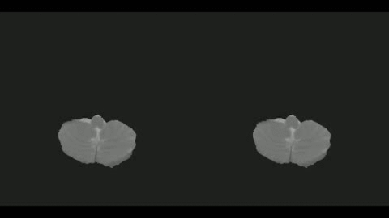
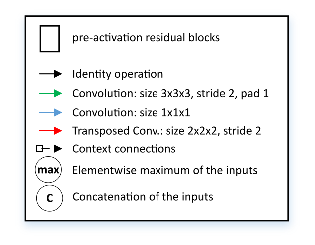
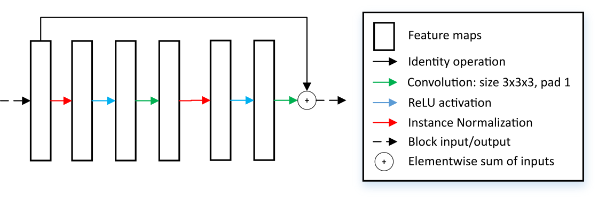
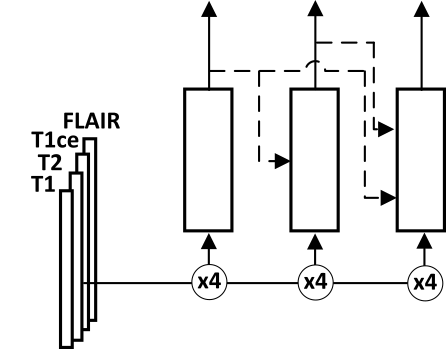

# Cascaded UNet for brain tumor segmentation
  
This code was written for participation in the [Brain Tumor Segmentation Challenge](https://www.med.upenn.edu/sbia/brats2018.html) (BraTS) 2018.  
The code is based on [the corresponding paper](https://arxiv.org/abs/1810.04008), where we present deep cascaded approach for automatic brain tumor segmentation. We modify 3D UNet architecture and implement specific augmentation strategy to efficiently handle multimodal MRI input, besides this we introduce approach to enhance segmentation quality with context obtained from models of the same topology operating on downscaled data.  
Each input modality has its own encoder which are later fused together to produce single output segmentation.  

## Network achitecture



### Structure of the residual block


### Cascading strategy
The cascading approach is also employed. The details can be found in the paper.  
* Dmitry Lachinov, Evgeny Vasiliev, and Vadim Turlapov. "Glioma Segmentation with Cascaded Unet." arXiv preprint arXiv:1810.04008 (2018).

<br/>


| Data        | WT           | ET  | TC |
| ------------- |:-------------:| :-----:|:----:|
| Val 2018 | 0.906      |    0.784 |0.844|
| Test 2018 | 0.878      |    0.720 |0.795|


## How to train
1. Download BraTS Dataset from the [brats website](https://www.med.upenn.edu/sbia/brats2018/data.html)
2. Edit the config
    1. open scripts/config.py
    2. edit variables from the Config section.
3. Run script preprocess_and_train.sh (to run both augmentation and training)

## How to validate
Run the following command. Dataset and models root directories will be taken from config.
```
python validate.py --name <model's name>
```

## How to perform prediction
Run the following command. Models root directory will be taken from config.
```
python predict.py --name <model's name> --test_data_dir <dir with test data> --out_data_dir <output dir> --is_single_series(optional)
```
`--is_single_series` indicates whether test_data_dir has only single series.

## Config
* data_directory - path to dataset root directory, should contain both HGG and LGG subdirectories
* augumented_directory - the output of augmentation procedure, should be initially empty
* models_root_path - path where the models will be stored
* segmentation_model_name - name of the segmentation model
* dataset_multiplier - number of augmentation runs. More this number is, more augmentation circles will be performed

## Train
```
cd scripts  
sh preprocess_and_train.sh <available port>
```

## Pre-trained model
Download checkpoint with the following [link](https://drive.google.com/file/d/1unR-ThwBuorgzGhbCsnZVd8VXnVVqZnG/view?usp=sharing), where models directory name is 'models_sm_1' and model itself has the name 'only_seg'.

## Run
```
python predict.py --name <model_name> --test_data_dir <input directory> --out_data_dir <output directory>
```

## Requirements
```
python 2.7
numpy
mxnet-cu90
scikit-learn
scikit-image
scipy
nibabel
tqdm
SimpleITK
itk
opencv-python
mxboard
matplotlib
tensorboard
```

## Docker
This model can be trained in the docker. Corresponding Dockerfile can be found in the repo root.
Training can be run with the following command:
```
nvidia-docker run --rm -t --name ${EXPERIMENT_NAME} \
  --user=$(id -u):$(id -g) $ADD_GROUPS \
  -v <path to dataset root>:/dataset \
  -v <path to models root>:/models \
  -v <path to scripts>:/scripts \
  -v ../compute_cache/:/cache \
  -p ${PORT}:${PORT}\
  -e CUDA_CACHE_MAXSIZE=2147483647\
  -e CUDA_CACHE_DISABLE=0\
  -e CUDA_CACHE_PATH="/cache" \
  $IMAGE_NAME bash -c "cd /scripts/ && ./preprocess_and_train.sh ${PORT}"
```